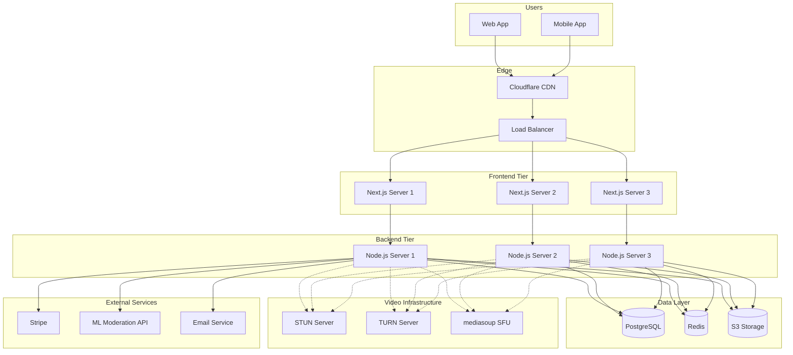
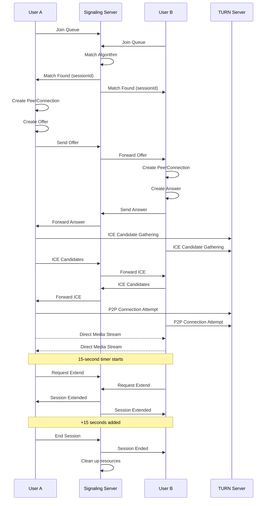
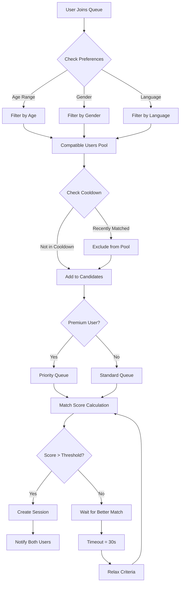
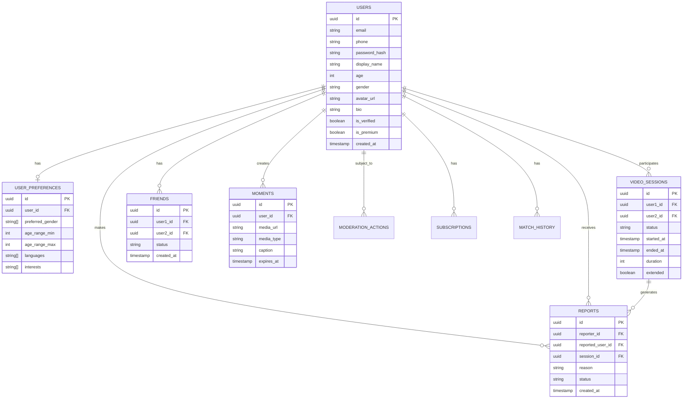
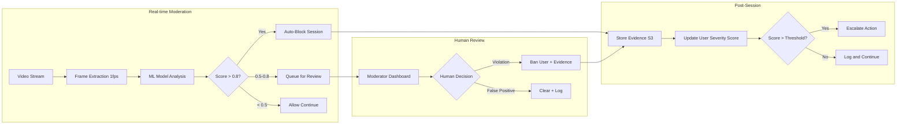
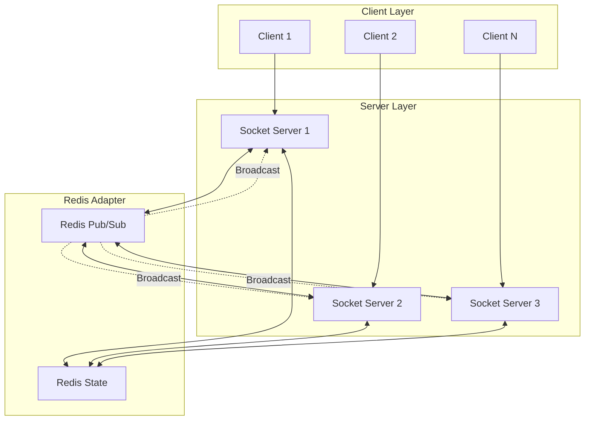
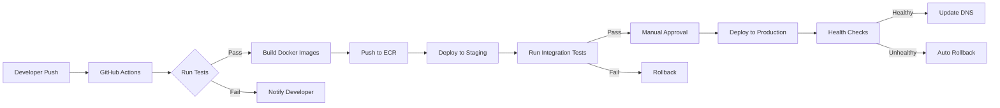
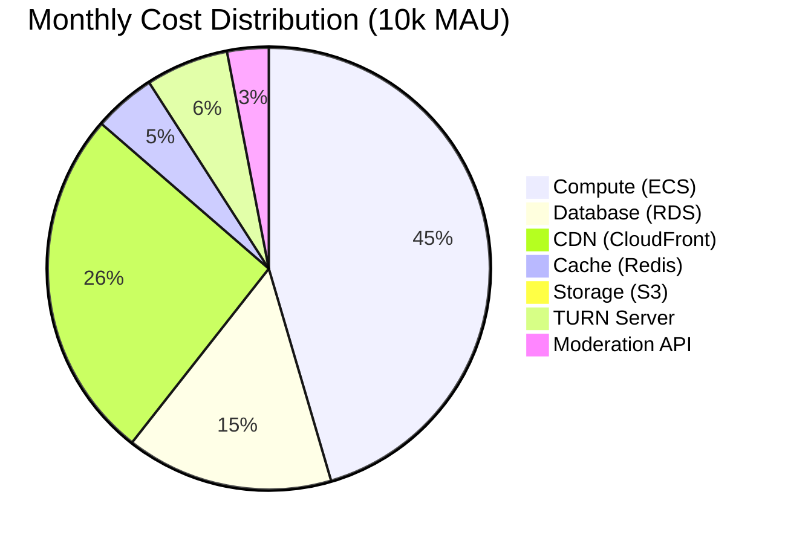

# Architecture Diagrams

## 1. High-Level System Architecture

## 2. WebRTC Signaling Flow

## 3. Matching Algorithm Flow

## 4. Database Schema Relationships

## 5. Content Moderation Pipeline

## 6. WebSocket Scaling Architecture

## 7. Deployment Pipeline

## 8. Infrastructure Cost Breakdown

