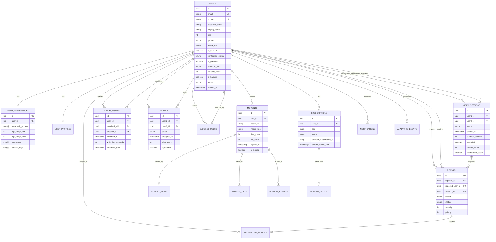

# Database Relationships & ER Diagram

## Entity Relationship Diagram



## Relationship Types

### One-to-One
- `User` ↔ `UserPreferences` (each user has one preference set)
- `User` ↔ `UserProfile` (each user has one extended profile)
- `Subscription` ↔ `SubscriptionFeature` (plan defines features)

### One-to-Many
- `User` → `VideoSession` (user participates in many sessions)
- `User` → `Moment` (user creates many moments)
- `User` → `Report` (user makes/receives many reports)
- `User` → `Notification` (user receives many notifications)
- `Moment` → `MomentView` (moment has many views)
- `Moment` → `MomentLike` (moment has many likes)
- `Moment` → `MomentReply` (moment has many replies)
- `Subscription` → `PaymentHistory` (subscription has many payments)

### Many-to-Many (resolved via junction tables)
- `User` ↔ `User` via `Friend` (friendship)
- `User` ↔ `User` via `BlockedUser` (blocking)
- `User` ↔ `User` via `MatchHistory` (matching)

## Cascade Rules

| Parent | Child | On Delete | On Update |
|--------|-------|-----------|-----------|
| User | UserPreferences | CASCADE | CASCADE |
| User | UserProfile | CASCADE | CASCADE |
| User | Moments | CASCADE | CASCADE |
| User | ModerationActions | CASCADE | CASCADE |
| User | Subscriptions | CASCADE | CASCADE |
| User | Notifications | CASCADE | CASCADE |
| Moment | MomentViews | CASCADE | CASCADE |
| Moment | MomentLikes | CASCADE | CASCADE |
| Moment | MomentReplies | CASCADE | CASCADE |
| VideoSession | Reports | RESTRICT | CASCADE |

## Data Flow Diagrams

### User Registration Flow
```
Client → API → Validate Input → Hash Password → Create User → Create Preferences → Create Profile → Return JWT
```

### Video Session Flow
```
User A → Join Queue → Match Algorithm → Find User B → Create Session → WebRTC Setup → Start Timer → End/Extend → Log History
```

### Report Flow
```
User → Report → Create Record → Calculate Severity → Auto-Action? → Queue for Review → Moderator Decision → Apply Action → Update User Score
```

### Subscription Flow
```
User → Select Plan → Stripe Checkout → Webhook → Create Subscription → Update User Premium → Grant Features → Track Billing
```
